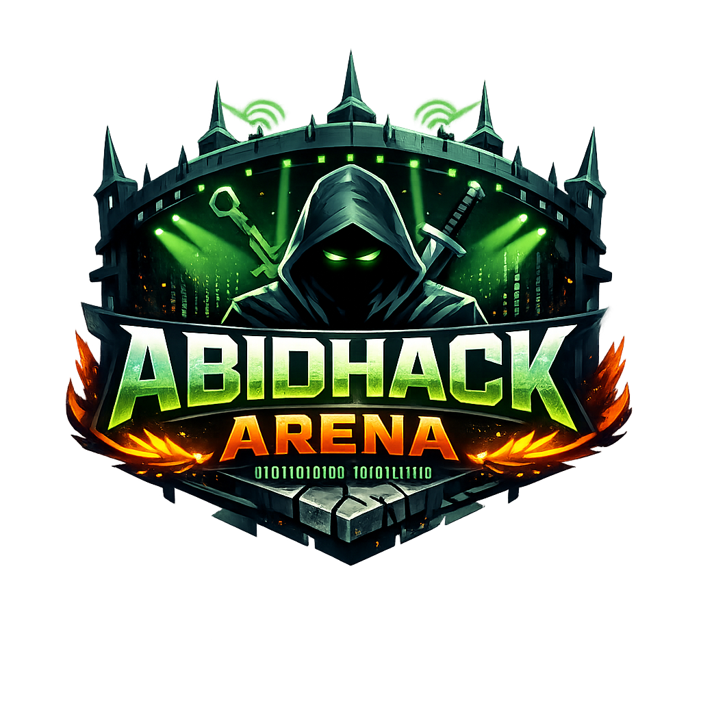

# AbidHack Arena - Interactive Cybersecurity Training Platform\n\n🚀 **A fully functional, responsive cybersecurity training platform built with HTML5, CSS3, and Vanilla JavaScript**\n\n\n\n## 🌟 Features\n\n### 🎯 Core Functionality\n- **Interactive Terminal** - 50+ Linux and cybersecurity commands\n- **Virtual Lab Environment** - Multiple VM options (Kali, Parrot, Windows, Ubuntu)\n- **CTF Challenges** - Web, Network, Crypto, and OSINT categories\n- **Progress Tracking** - XP system, levels, and achievements\n- **User Authentication** - Complete login/signup system with local storage\n- **Responsive Design** - Fully optimized for mobile devices with hamburger menu\n\n### 🛠️ Advanced Tools (127+ Tools)\n- **Reconnaissance**: Nmap, Masscan, RustScan, Gobuster\n- **Web Testing**: Burp Suite, SQLMap, Nikto, OWASP ZAP\n- **Exploitation**: Metasploit, MSFVenom, SearchSploit\n- **Password Attacks**: John the Ripper, Hashcat, Hydra\n- **Forensics**: Volatility, Autopsy, Wireshark\n- **And many more...**\n\n### 📱 Mobile Optimization\n- **Hamburger Menu** - Three-line mobile navigation\n- **Touch-Friendly** - Optimized for Android and iOS\n- **Responsive Layout** - Adapts to all screen sizes\n- **Performance Optimized** - Fast loading on mobile networks\n\n## 🚀 Quick Start\n\n### Option 1: GitHub Pages (Recommended)\n1. Fork this repository\n2. Go to Settings → Pages\n3. Select \"Deploy from a branch\" → \"main\"\n4. Your site will be available at `https://yourusername.github.io/abidhack-arena`\n\n### Option 2: Local Development\n1. Clone the repository:\n   ```bash\n   git clone https://github.com/yourusername/abidhack-arena.git\n   cd abidhack-arena\n   ```\n\n2. Open `index.html` in your browser or use a local server:\n   ```bash\n   # Using Python\n   python -m http.server 8000\n   \n   # Using Node.js\n   npx serve .\n   \n   # Using PHP\n   php -S localhost:8000\n   ```\n\n3. Navigate to `http://localhost:8000`\n\n## 📁 Project Structure\n\n```\nabidhack-arena/\n├── index.html              # Landing page\n├── dashboard.html          # User dashboard\n├── lab.html               # Virtual lab environment\n├── challenges.html        # CTF challenges\n├── leaderboard.html       # Global rankings\n├── practical-labs.html    # VM selection and scenarios\n├── login.html            # User authentication\n├── signup.html           # User registration\n├── profile.html          # User profile management\n├── styles-new.css        # Enhanced responsive CSS\n├── main.js              # Core functionality\n├── lab-engine.js        # Terminal and lab logic\n├── practical-labs.js    # VM and scenario management\n├── challenges.js        # CTF challenge system\n├── mobile-menu.js       # Mobile navigation\n├── optimizer.js         # Performance optimization\n└── logo.png            # Platform logo\n```\n\n## 🎮 How to Use\n\n### 1. Getting Started\n- Visit the landing page\n- Click \"Start Hacking\" or \"Enter Lab\"\n- Sign up for a new account or use the demo\n\n### 2. Dashboard\n- View your progress and statistics\n- Access quick actions\n- Monitor your XP and level\n\n### 3. Virtual Labs\n- Choose from multiple VM environments\n- Launch specialized lab scenarios\n- Use the interactive terminal with 50+ commands\n\n### 4. CTF Challenges\n- Solve challenges across 4 categories\n- Earn XP points and achievements\n- Track your progress on the leaderboard\n\n### 5. Mobile Usage\n- Tap the hamburger menu (☰) on mobile devices\n- All features work seamlessly on smartphones\n- Optimized touch interactions\n\n## 🔧 Technical Details\n\n### Technologies Used\n- **Frontend**: HTML5, CSS3, Vanilla JavaScript\n- **Storage**: Local Storage (no backend required)\n- **Fonts**: Orbitron, Fira Code (Google Fonts)\n- **Icons**: Unicode emojis for universal compatibility\n- **Responsive**: CSS Grid, Flexbox, Media Queries\n\n### Browser Compatibility\n- ✅ Chrome 80+\n- ✅ Firefox 75+\n- ✅ Safari 13+\n- ✅ Edge 80+\n- ✅ Mobile browsers (iOS Safari, Chrome Mobile)\n\n### Performance Features\n- Lazy loading for images\n- Optimized animations\n- Minimal JavaScript bundle\n- Efficient CSS with hardware acceleration\n- Touch device optimizations\n\n## 📱 Mobile Features\n\n### Navigation\n- **Hamburger Menu**: Three-line icon that opens full-screen navigation\n- **Touch Targets**: All buttons are minimum 44px for easy tapping\n- **Swipe Gestures**: Smooth scrolling and interactions\n\n### Responsive Design\n- **Breakpoints**: 480px, 768px, 992px, 1200px+\n- **Flexible Layouts**: Grid and flexbox adapt to screen size\n- **Typography**: Scales appropriately for readability\n- **Images**: Optimized for different pixel densities\n\n### Touch Optimizations\n- **Input Fields**: 16px font size prevents zoom on iOS\n- **Hover Effects**: Converted to touch-friendly interactions\n- **Scrolling**: Smooth momentum scrolling\n- **Orientation**: Supports both portrait and landscape\n\n## 🎨 Customization\n\n### Branding\n- Replace `logo.png` with your own logo\n- Update the title in HTML files\n- Modify colors in `styles-new.css`:\n  ```css\n  :root {\n    --primary-green: #00ff41;\n    --primary-blue: #0066ff;\n    --background-dark: #000;\n  }\n  ```\n\n### Content\n- Add new challenges in `challenges.html`\n- Modify lab scenarios in `practical-labs.html`\n- Update terminal commands in `lab-engine.js`\n\n## 🔒 Security Features\n\n- **Local Storage**: All data stored locally, no server required\n- **Input Validation**: Form validation and sanitization\n- **XSS Prevention**: Proper content escaping\n- **Educational Focus**: All activities are simulated and safe\n\n## 🤝 Contributing\n\n1. Fork the repository\n2. Create a feature branch: `git checkout -b feature-name`\n3. Commit changes: `git commit -am 'Add feature'`\n4. Push to branch: `git push origin feature-name`\n5. Submit a Pull Request\n\n### Development Guidelines\n- Follow existing code style\n- Test on multiple devices and browsers\n- Ensure mobile responsiveness\n- Add comments for complex functionality\n- Update README for new features\n\n## 📄 License\n\nThis project is licensed under the MIT License - see the [LICENSE](LICENSE) file for details.\n\n## 🙏 Acknowledgments\n\n- **Inspiration**: TryHackMe, HackTheBox, and other cybersecurity platforms\n- **Design**: Cyberpunk and hacker aesthetics\n- **Community**: Ethical hacking and cybersecurity education\n\n## 📞 Support\n\n- **Issues**: Report bugs via GitHub Issues\n- **Discussions**: Use GitHub Discussions for questions\n- **Documentation**: Check the wiki for detailed guides\n\n## 🚀 Deployment Checklist\n\n- [x] Responsive design for all devices\n- [x] Mobile hamburger menu\n- [x] Touch-friendly interactions\n- [x] Performance optimizations\n- [x] Cross-browser compatibility\n- [x] Local storage functionality\n- [x] Interactive terminal\n- [x] CTF challenges\n- [x] User authentication\n- [x] Progress tracking\n- [x] GitHub Pages ready\n\n---\n\n**AbidHack Arena** - Where cybersecurity education meets interactive learning! 🛡️💻\n\n*Built with ❤️ for the cybersecurity community*